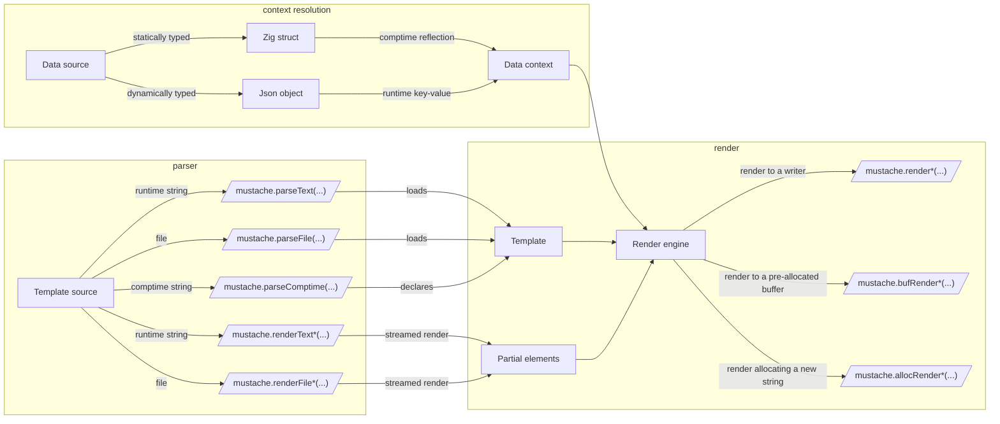

# MUSTACHE-ZIG
# [{{mustache}}](https://mustache.github.io/) templates for [Zig](https://ziglang.org/).

[](https://ziglang.org/)
[](https://github.com/batiati/mustache-zig/actions/workflows/ci-codecov.yml)
[](https://codecov.io/gh/batiati/mustache-zig)
[](https://github.com/batiati/mustache-zig/blob/master/LICENSE.txt)


# ! Under development !

- Windows support is broken at the moment

## Features

✓ [Comments](https://github.com/mustache/spec/blob/master/specs/comments.yml) `{{! Mustache is awesome }}`.

✓ Custom [delimiters](https://github.com/mustache/spec/blob/master/specs/delimiters.yml) `{{=[ ]=}}`.

✓ [Interpolation](https://github.com/mustache/spec/blob/master/specs/interpolation.yml) of common types, such as strings, enums, bools, optionals, pointers, integers, floats and JSON objects into `{{variables}`.

✓ [Unescaped interpolation](https://github.com/mustache/spec/blob/b2aeb3c283de931a7004b5f7a2cb394b89382369/specs/interpolation.yml#L52) with `{{{tripple-mustache}}}` or `{{&ampersant}}`.

✓ Rendering [sections](https://github.com/mustache/spec/blob/master/specs/sections.yml) `{{#foo}} ... {{/foo}}`.

✓ [Section iterator](https://github.com/mustache/spec/blob/b2aeb3c283de931a7004b5f7a2cb394b89382369/specs/sections.yml#L133) over slices, arrays and tuples `{{slice}} ... {{/slice}}`.

✓ Rendering [inverted sections](https://github.com/mustache/spec/blob/master/specs/inverted.yml) `{{^foo}} ... {{/foo}}`.

✓ [Lambdas](https://github.com/mustache/spec/blob/master/specs/~lambdas.yml) expansion.

✓ Rendering [partials](https://github.com/mustache/spec/blob/master/specs/partials.yml) `{{>file.html}}`.

☐ Rendering [parents and blocks](https://github.com/mustache/spec/blob/master/specs/~inheritance.yml) `{{<file.html}}` and `{{$block}}`.

## Full spec compliant

✓ All implemented features passes the tests from [mustache spec](https://github.com/mustache/spec).

## Examples

Render from strings, files and pre-loaded templates.
See the [source code](https://github.com/batiati/mustache-zig/blob/master/samples/src/main.zig) for more details.

### Runtime parser

```Zig

const std = @import("std");
const mustache = @import("mustache");

pub fn main() !void {
    const template =
        \\Hello {{name}} from Zig
        \\Supported features:
        \\{{#features}}
        \\  - {{name}}
        \\{{/features}}
    ;

    var data = .{
        .name = "friends",
        .features = .{
            .{ .name = "interpolation" },
            .{ .name = "sections" },
            .{ .name = "delimiters" },
            .{ .name = "partials" },
        },
    };

    const allocator = std.testing.allocator;
    const result = try mustache.allocRenderText(allocator, template, data);
    defer allocator.free(result);

    try std.testing.expectEqualStrings(
        \\Hello friends from Zig
        \\Supported features:
        \\  - interpolation
        \\  - sections
        \\  - delimiters
        \\  - partials
        \\
    , result);
}

```

### Comptime parser

```Zig

const std = @import("std");
const mustache = @import("mustache");

pub fn main() !void {

    const template_text = "It's a comptime loaded template, with a {{value}}";
    const comptime_template = comptime mustache.parseComptime(template_text, .{}, .{});
    
    var data = .{
        .value = "runtime value"
    };

    const allocator = std.testing.allocator;
    const result = try mustache.allocRender(comptime_template, data);
    defer allocator.free(result);

    try std.testing.expectEqualStrings(
        "It's a comptime loaded template, with a runtime value", 
        result,
    );
}

```


### JSON support

```Zig

const std = @import("std");
const mustache = @import("mustache");

pub fn main() !void {
    const template = "Hello {{name}} from Zig";

    const allocator = std.testing.allocator;

    var parser = std.json.Parser.init(allocator, false);
    defer parser.deinit();

    // Parsing an arbitrary json string
    var json = try parser.parse(
        \\{
        \\   "name": "friends"
        \\}
    );
    defer json.deinit();

    const result = try mustache.allocRenderText(allocator, template, json);
    defer allocator.free(result);

    try std.testing.expectEqualStrings("Hello friends from Zig" , result);
}

```

## Customizable use

No "one size fits all", but mustache-zig's API aims to offer flexibility of use, allowing the user to choose the most optimal configuration for their use case. 


## Benchmarks.

There are [some benchmark tests](benchmark/src/ramhorns_bench.zig) inspired by the excellent [Ramhorns](https://github.com/maciejhirsz/ramhorns)'s benchmarks, comparing the performance of most popular **Rust** template engines.

1. Rendering to a new allocated string 1 million times

    |                                                               | Total time | ns/iter  | MB/s      
    ----------------------------------------------------------------|------------|----------|-----------
    |[Ramhorns 0.14.0](https://crates.io/crates/ramhorns)           | 0,040s     |    40 ns | 2425 MB/s
    |[Askama 0.9](https://crates.io/crates/askama)                  | 0,136s     |   136 ns |  713 MB/s
    |[Tera 1.2.0](https://crates.io/crates/tera)                    | 0,308s     |   308 ns |  314 MB/s
    |[Mustache 0.9](https://crates.io/crates/mustache)              | 0,363s     |   363 ns |  267 MB/s
    |[Handlebars 3.1.0-beta.2](https://crates.io/crates/handlebars) | 1,833s     | 1,833 ns |   52 MB/s

2. Parsing a template 1 million times

    |                                                               | Total time | ns/iter   | MB/s      
    ----------------------------------------------------------------|------------|-----------|-----------
    |[Ramhorns 0.14.0](https://crates.io/crates/ramhorns)           |  0,040s    |    317 ns |  492 MB/s
    |[Mustache 0.9](https://crates.io/crates/mustache)              |  5,863s    |  5,863 ns |   26 MB/s
    |[Handlebars 3.1.0-beta.2](https://crates.io/crates/handlebars) | 11,797s    | 11,797 ns |   13 MB/s


_*All benchmarks were executed using `cargo bench` on a Intel i7-1185G7 @ 3.00GHz, Linux kernel 5.17_

>For comparision with mustache-zig, refer to "Rendering to a new allocated string 1 million times" and "Parsing a template 1 million times" sections bellow.
### Mustache vs Zig's fmt

The same benchmark was implemented in Zig for both mustache-zig and Zig's `std.fmt`.

We can assume that Zig's `std.fmt` is the **fastest** possible way to render a simple string using Zig. [This benchmark](benchmark/src/ramhorns_bench.zig) shows how much **slower** a mustache template is rendered when compared with the same template rendered by Zig's `std.fmt`.

1. Rendering to a pre-allocated buffer 1 million times

    |               | Total time | ns/iter | MB/s      | Penality
    ----------------|------------|---------|-----------|-------
    |Zig fmt        | 0.042s     | 42 ns   | 2596 MB/s | -- 
    |mustache-zig   | 0.094s     | 94 ns   | 1149 MB/s | 2.260x slower


2. Rendering to a new allocated string 1 million times

    |               | Total time | ns/iter | MB/s      | Penality
    ----------------|------------|---------|-----------|-------
    |Zig fmt        | 0.058s     |  58 ns  | 1869 MB/s | -- 
    |mustache-zig   | 0.167s     | 167 ns  |  645 MB/s | 2.897x slower


3. Rendering to a local file 1 million times

    |               | Total time | ns/iter | MB/s      | Penality
    ----------------|------------|---------|-----------|-------
    |Zig fmt        | 0.079s     |  79 ns  | 1367 MB/s | -- 
    |mustache-zig   | 0.125s     | 125 ns  |  862 MB/s | 1.586x slower


4. Parsing a template 1 million times

    |               | Total time | ns/iter  | MB/s      
    ----------------|------------|----------|-----------
    |mustache-zig   | 1.380s     | 1,380 ns |  182 MB/s 


_*All benchmarks were compiled as ReleaseSafe, and executed on a Intel i7-1185G7 @ 3.00GHz, Linux kernel 5.17_

### Memory benchmarks

Mustache templates are well known for HTML templating, but it's useful to render any kind of dynamic document, and potentially load templates from untrusted or user-defined sources.

So, it's also important to be able to deal with multi-megabyte inputs without eating all your RAM.

```Zig

    // 32KB should be enough memory for this job
    // 16KB if we don't need to support lambdas 😅
    var plenty_of_memory = std.heap.GeneralPurposeAllocator(.{ .enable_memory_limit = true }){
        .requested_memory_limit = 32 * 1024,
    };
    defer _ = plenty_of_memory.deinit();

    try mustache.renderFile(plenty_of_memory.allocator(), "10MB_file.mustache", ctx, out_writer);

```

## Licensing

- MIT

- Mustache is Copyright (C) 2009 Chris Wanstrath
Original CTemplate by Google